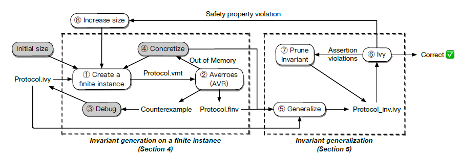

<!-- Title -->
# SOSP'19: I4: Incremental Inference of Inductive Invariants for Verification of Distributed Protocols

## Keywords
Inductive Invariant Generation, Distributed Protocol

## Quick Summary
> **Insight:** invariant elements are independent on the size of the system

> **Core Idea**: finit instance inductive  ---(generalize)---> infinite protocol

## Background
+ Tools (IronFleet & Verdi): manual effort
+ pretend synchrony: transform an asynchronous system into a synchronous one
+ aaa[^1](#1)

## Motivation
The basic elements of these invariants are independent of the size of the system, and that they can therefore be inferred from small, finite instances.

## Methodology

## Evaluation

## Future Work

## References:
1: Automatic deductive verification with invisible invariants
